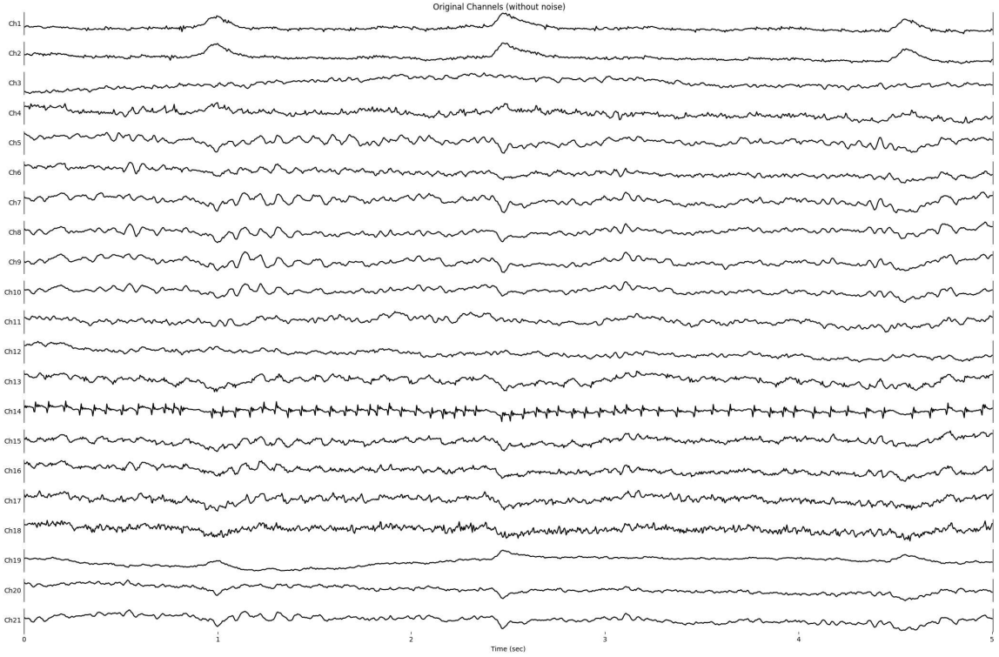
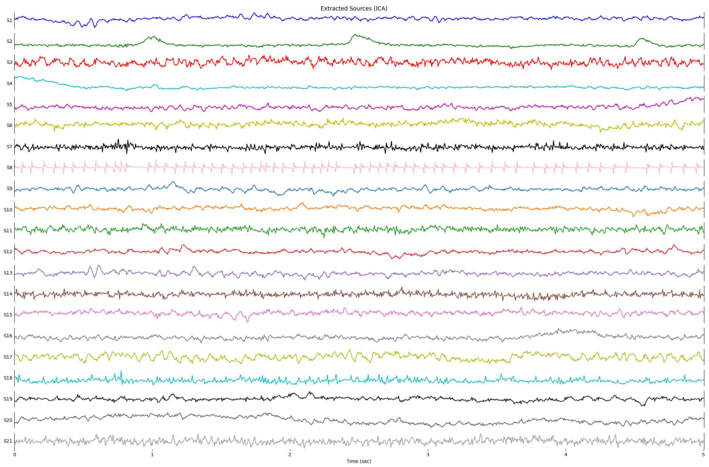
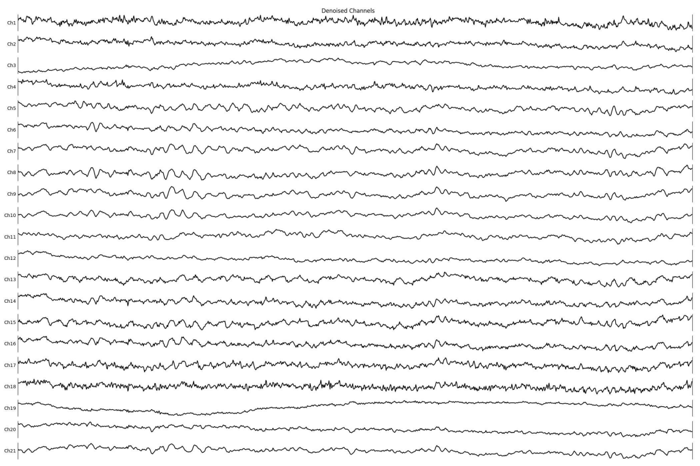

## Revolutionizing EEG Signal Analysis: Advanced Noise Reduction Techniques

Welcome to my repository dedicated to enhancing the clarity and quality of EEG (Electroencephalography) data through innovative noise reduction methodologies. This project lies at the confluence of neuroscience and data science, representing a significant leap in EEG signal processing.

### Project Overview
EEG signals are notoriously noisy, making accurate analysis a challenge. This project aims to address this by applying two sophisticated statistical techniques: Independent Component Analysis (ICA) and Principal Component Analysis (PCA). The goal is to isolate and enhance crucial neural signals obscured by noise, thereby improving the reliability and interpretability of EEG data.

### Some Results:
#### Original Channels

  

#### ICA

  

#### Denoised

  

### What's Inside
- 📈 **In-Depth Analysis**: Detailed Jupyter notebooks explaining each step of the process, from noise addition to signal reconstruction.
- 📊 **Visualization Tools**: Scripts for generating insightful plots that compare the efficacy of ICA and PCA across different Signal-to-Noise Ratios (SNRs).
- 🧮 **Performance Metrics**: Implementation of the Relative Root Mean Square Error (RRMSE) to quantitatively assess the improvement in signal quality.
- 🌐 **Comprehensive Documentation**: Clear, concise documentation for each script, ensuring ease of understanding and reproducibility.

### Key Highlights
- 🧠 **EEG Signal Processing**: Techniques to enhance the clarity of EEG signals, crucial in neurological research and diagnostics.
- 🎓 **Advanced Statistical Methods**: Application and comparison of ICA and PCA, two pivotal techniques in signal processing and machine learning.
- 📝 **Python & Pandas Implementation**: The entire project is developed using Python, leveraging libraries like Pandas for data manipulation and Matplotlib for visualization.

### Getting Started
Clone this repository and explore the notebooks to see the project in action. Whether you're a data scientist, a neuroscientist, or just someone interested in EEG signal processing, there's something here for you.

### Contributing
Contributions, questions, and feedback are always welcome. Feel free to fork this repository or reach out to me directly for any suggestions or discussions.

---

### Connect With Me
Don't hesitate to connect with me on LinkedIn for more updates on this project and future explorations in the intersection of data science and neuroscience.

